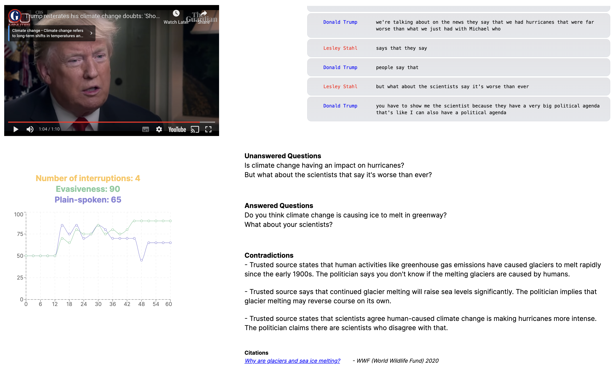

## Inspiration 💡

Have you ever watched a TV interview and been incredibly frustrated when none of the questions asked were actually answered?

## What it does 🧐

From video/audio input, transcribes interviews and analyses the transcription for:

- Fact-checking against a trusted information bank
- Rhetorical evasiveness
- Tracking which questions have been asked and answered in the interview

## How we built it 🛠️

- GCP Speech-to-text API, Cloud Storage, Cloud Function as infra for the analysis
- React/NextJS/TS for frontend display of analysis
- All analysis itself done using Claude, featuring prompt engineering and RAG for fact-checking purposes

## Challenges we ran into 🥲

- Speech diarization (determining who says what in an audio clip is often inaccurate using publicly available tools). Examples demoed are cherry-picked to be particularly suited to this
- Speech-to-text APIs require audio in specific formats

## Accomplishments that we're proud of 💪

Very happy with the quality of the analysis and the resulting visual representation. It proves that this is a tool that could genuinely be incorporated into news channel footage or for interviewers to help them hold interviewees to account in the moment

## What we learned 🧑‍🏫

- How to use the GCP Speech-to-text APIs.
- Lots about Claude and how to get it to generate structured output using prompt engineering, XML and similar techniques

## What's next for Factician 📈

- Improve accuracy of speaker diarization
- Support audio streaming from variety of sources
- Incorporate analysis into live video feed directly
